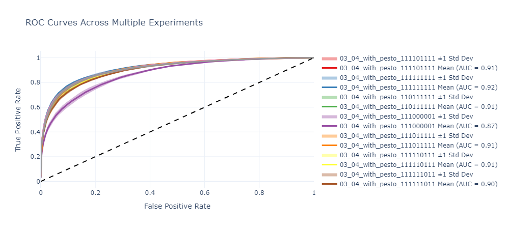

# UbiNet

## Conda

### ubinet - non-exact matching
All code should run using the ```ubinet``` conda environment. <br>
In order to build the environment, run:
```
conda create -n ubinet
conda activate ubinet
conda install numpy pandas scikit-learn matplotlib plotly seaborn
pip install -U tensorflow keras biopython networkx nbformat
```

### ubinet_experiment - recommended
```
conda create -n "ubinet_experiment" python=3.10.12
conda activate ubinet_experiment
pip install -r requirements_clean.txt
```

### experiment - need to check
```
conda env create -f environment.yml python=3.10.12
conda activate experiment
```

## Patch2Score
### Configuration
A Patch2Score training is defined by a configuration (json) file. <br>
Such configuration files can be found under ```configurations/data/<hypothesis_name>/<experiment_name>.json```. <br>
For example: ```configuration/data/pesto_scores_ablation_reproduce/111111111.json```. <br>

#### Naming
For ease of run, several experiments (trainings) are combined together into a "hypothesis". <br>
The idea is that for each hypothesis we check, we'll run several experiments, where each experiment is a train.

### Train
In order to train the model based on a configuration, run:
```  
python3 models/patch_to_score/train.py <hypothesis_name>
```
An example for a specific run:
```
python3 models/patch_to_score/train.py pesto_scores_ablation_reproduce
```
Such a run will take all experiments under the hypothesis stated, and will run each of them seperately.

### Results
Results will be saved under ```results/patch_to_score/hypotheses/<hypothesis_name>/<experiment_name>/<random_id>```.<br>
The ```<random_id>``` is added so several runs of the same experiment won't override each other.

### Specific Experiments
#### PeSTo ablation
ABLATION STRING[i] = 1 MEANS THAT WE ARE USING THE I'TH FEATURE FROM THIS LIST OF FEATURES:<br>
[patch size , scanNet_ubiq , scanNet_protein , pesto_protein , pesto_dna_rna , pesto_ion , pesto_ligand , pesto_lipid , average_plddt]<br>
Ablation results:

